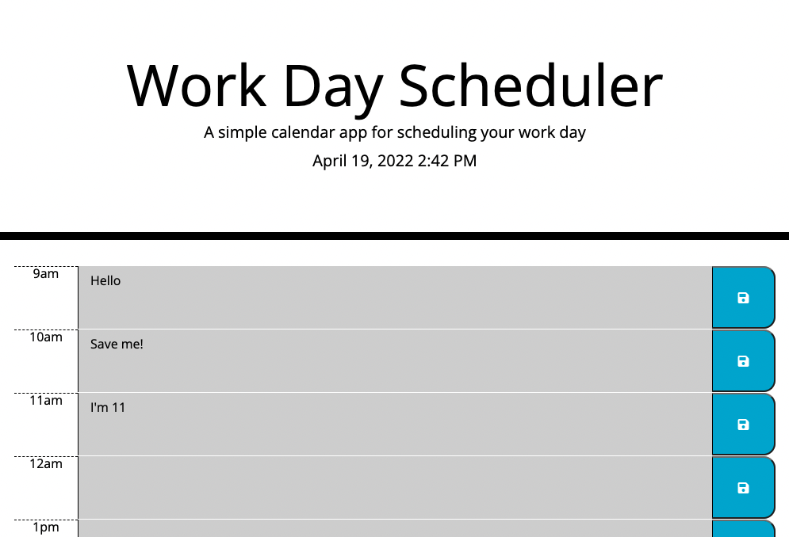

# Work Day Scheduler Starter Code

Created a simple calendar application that allows a user to save events for each hour of the day. This app will run in the browser and feature dynamically updated HTML and CSS powered by jQuery and using Moment JS.

## Deployed App

[Deployed app]()

## Screenshot of Deployed App

